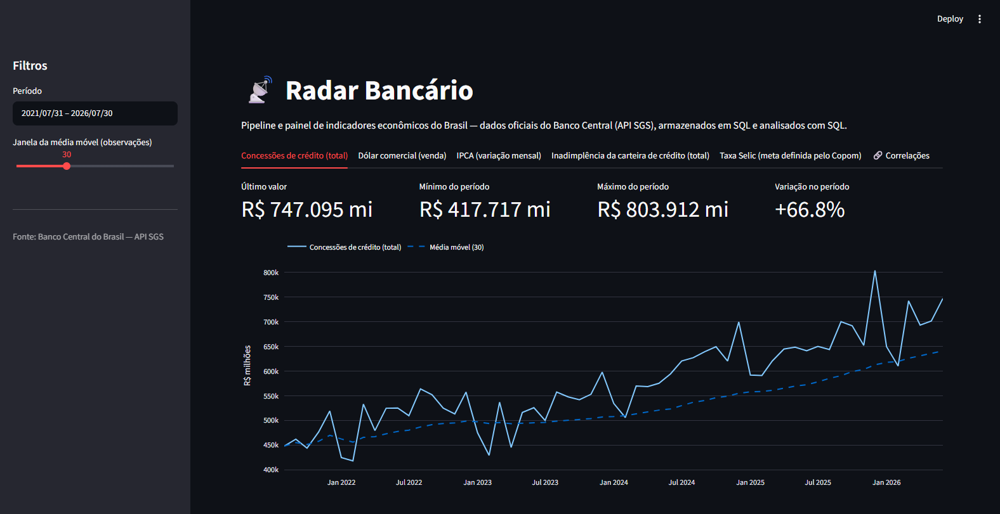
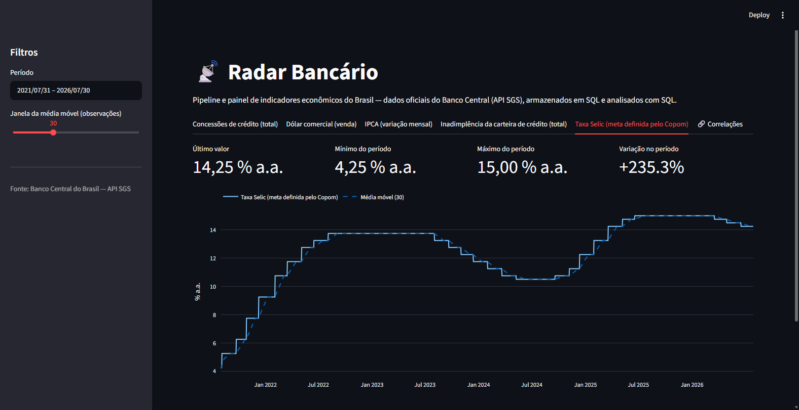
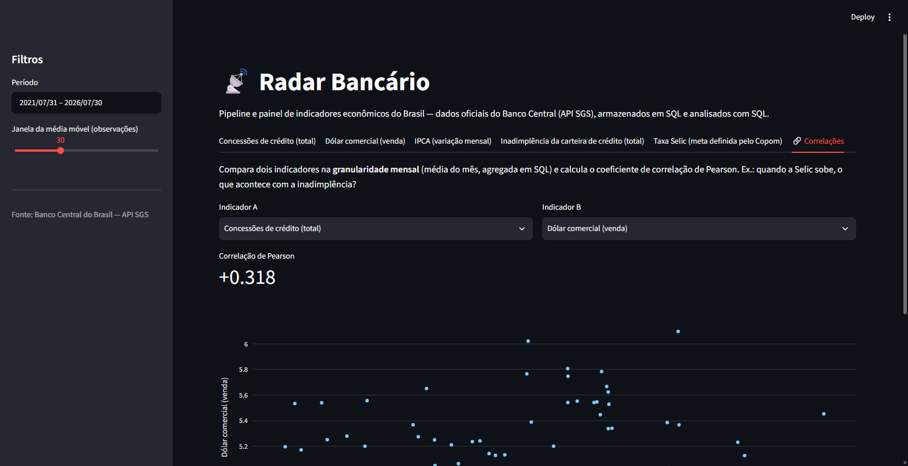
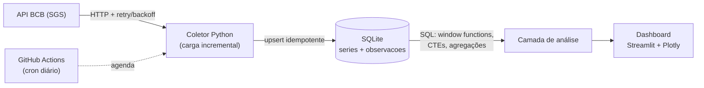

# 📡 Radar Bancário

**Pipeline e painel de indicadores econômicos do Brasil** — um sistema completo de engenharia de dados que coleta séries oficiais do Banco Central (API SGS), armazena em banco SQL modelado, calcula métricas **em SQL** e apresenta tudo em um dashboard interativo.

> Em vez de scripts isolados que analisam uma série cada, um sistema de ponta a ponta sobre os indicadores que um banco olha todos os dias: **Selic, dólar, IPCA, inadimplência e concessões de crédito**.

---

## 🖼️ O dashboard

**Visão geral** — abas por indicador, KPIs do período e média móvel configurável:



**Ciclo da Selic** — a série da meta do Copom com média móvel de 30 observações:



**Painel de correlação** — dois indicadores alinhados na granularidade mensal (em SQL) com coeficiente de Pearson e dispersão:



## 🏛️ Arquitetura



| Camada | Arquivo | Responsabilidade |
|---|---|---|
| **Coleta** | `src/radar/sgs_client.py` | Cliente HTTP da API SGS: retry com backoff exponencial, timeout, consulta em blocos de ~10 anos (limite da API) e validação da resposta |
| **Orquestração** | `src/radar/collector.py` | Carga incremental e isolamento de falhas por série |
| **Armazenamento** | `src/radar/database.py` + `sql/schema.sql` | Banco SQL modelado (metadados × fatos), upserts idempotentes |
| **Análise** | `src/radar/queries.py` | Métricas calculadas **em SQL**, não em Pandas |
| **Apresentação** | `dashboard/app.py` | Dashboard com abas por indicador, filtros de período e painel de correlação |

## 📊 Indicadores coletados

| Indicador | Código SGS | Frequência | Por que importa para um banco |
|---|---|---|---|
| Taxa Selic (meta Copom) | 432 | Diária | Custo do dinheiro; referência de toda a precificação |
| Dólar comercial (venda) | 1 | Diária | Exposição cambial e cenário macro |
| IPCA (variação mensal) | 433 | Mensal | Inflação; juro real e poder de compra |
| Inadimplência da carteira de crédito | 21082 | Mensal | Risco de crédito — o indicador central do negócio |
| Concessões de crédito (total) | 20631 | Mensal | Apetite e volume do mercado de crédito |

O catálogo fica em [`config/series.yaml`](config/series.yaml): **adicionar um indicador novo é editar configuração, não código.**

## ⚙️ Conceitos de engenharia de dados aplicados

- **Carga incremental** — o coletor consulta `MAX(data)` por série no banco e pede à API apenas o período faltante. A primeira carga baixa o histórico completo; as seguintes, só o que é novo.
- **Idempotência** — `INSERT ... ON CONFLICT (serie_id, data) DO UPDATE`: reexecutar a coleta nunca duplica dados.
- **Isolamento de falhas** — erro em uma série não derruba a coleta das demais; o pipeline só falha se **todas** as séries falharem.
- **Resiliência de rede** — retry com backoff exponencial para os erros transitórios (429/5xx/timeout) que a API do BCB de fato apresenta.
- **Modelagem SQL** — tabela `series` (metadados) e `observacoes` (fatos) com chave estrangeira e unicidade `(serie_id, data)`; nada de CSV solto.

## 🧮 Análises em SQL (o diferencial)

As métricas são calculadas no banco — o Pandas é só a ponte para o dashboard:

- **Média móvel** — window function `AVG() OVER (ORDER BY data ROWS BETWEEN n-1 PRECEDING AND CURRENT ROW)`
- **Variação percentual** — window function `LAG()` sobre observações consecutivas
- **Resumo do período** — CTE com último valor, mínimo, máximo e variação
- **Correlação entre indicadores** — séries diárias e mensais alinhadas por competência mensal via CTEs (`strftime('%Y-%m', data)` + `AVG`), com os somatórios do coeficiente de Pearson agregados em SQL

> Ex.: *"Quando a Selic sobe, o que acontece com a inadimplência?"* — o painel de correlação responde com coeficiente de Pearson e gráfico de dispersão.

## 🚀 Como executar

Pré-requisito: Python 3.11+

```bash
# 1. Clonar e instalar dependências
git clone https://github.com/Joaofernandes-DEV/RadarBancario-.git
cd RadarBancario-
pip install -r requirements.txt

# 2. Coletar os dados (primeira execução baixa o histórico completo)
python main.py

# 3. Abrir o dashboard
streamlit run dashboard/app.py
```

O banco SQLite fica em `data/radar.db`. Para recomeçar do zero, basta apagar o arquivo e rodar `python main.py` novamente.

### Testes

```bash
pytest tests/ -q
```

12 testes cobrem o parsing da API, a carga incremental, a idempotência e todas as consultas SQL (incluindo correlações perfeitas ±1 como casos de controle).

## 🤖 Pipeline automatizado (GitHub Actions)

O workflow [`coleta_diaria.yml`](.github/workflows/coleta_diaria.yml) roda em dias úteis às 9h (horário de Brasília):

1. Instala as dependências e roda os testes;
2. Executa a coleta incremental;
3. Commita o `data/radar.db` atualizado de volta ao repositório.

Como o banco é versionado, o deploy do dashboard no [Streamlit Community Cloud](https://streamlit.io/cloud) sempre lê dados frescos — **o pipeline roda sozinho todo dia.**

## 📁 Estrutura do projeto

```
radar-bancario/
├── .github/workflows/
│   └── coleta_diaria.yml      # agendamento diário da coleta
├── config/
│   └── series.yaml            # catálogo declarativo das séries SGS
├── dashboard/
│   └── app.py                 # Streamlit: abas, KPIs, correlações
├── data/
│   └── radar.db               # SQLite (versionado — atualizado pelo Actions)
├── sql/
│   └── schema.sql             # DDL das tabelas series e observacoes
├── src/radar/
│   ├── sgs_client.py          # cliente HTTP da API SGS
│   ├── collector.py           # coleta incremental
│   ├── database.py            # conexão, schema, upserts
│   └── queries.py             # análises em SQL
├── tests/
│   ├── test_collector.py
│   └── test_queries.py
├── main.py                    # ponto de entrada da coleta
└── requirements.txt
```

## 🛠️ Stack

Python 3.11+ · SQLite · SQL (window functions, CTEs) · Requests · Streamlit · Plotly · Pandas · PyYAML · Pytest · GitHub Actions

## 🗺️ Evoluções previstas

- [ ] Migração do SQLite para PostgreSQL (o SQL já é padrão; a troca é de conexão)
- [ ] Deploy público do dashboard no Streamlit Community Cloud
- [ ] Novos indicadores via `config/series.yaml` (CDI, IGP-M, saldo de crédito por segmento)
- [ ] Alertas de variação atípica (ex.: inadimplência acima de banda histórica)

## 📄 Fonte dos dados

Todos os dados são públicos e oficiais, obtidos do [SGS — Sistema Gerenciador de Séries Temporais](https://www3.bcb.gov.br/sgspub/) do Banco Central do Brasil.

---

Feito por **João Vitor Fernandes** — [GitHub](https://github.com/Joaofernandes-DEV)
